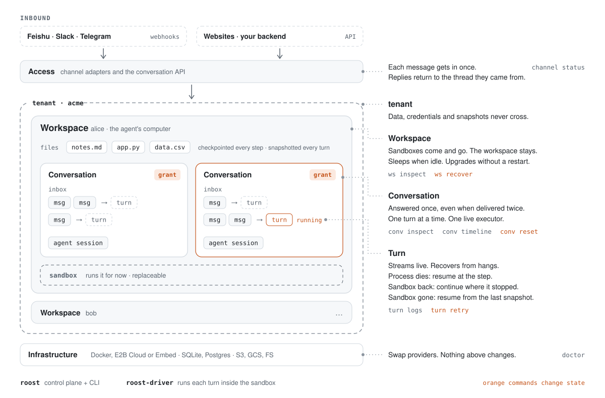

<p align="center">
  
</p>

<h1 align="center">roost</h1>

<p align="center">
  <b>A durable runtime for Claude Code and Codex.</b><br>
  A workspace that never dies. An agent that never answers twice.
</p>

> [!NOTE]
> roost is being rewritten in Go. This README describes the design being built; the code currently on `main` is the earlier Python prototype and is being replaced. Nothing below is released yet.

## Why

You put Claude Code or Codex behind a chat: every user gets an agent, every agent gets a sandbox. Then production happens.

- **Sandboxes die.** They time out, get paused, crash. The conversation's files and context go with them.
- **Webhooks retry.** The same message arrives twice, and the agent answers twice.
- **Agents hang.** A turn stalls halfway through a task and nobody notices.
- **You ship upgrades.** Every live conversation has to start over.
- **Users open more threads.** Either each thread gets its own sandbox and can't see the others' files, or two threads edit the same files at once.

roost takes that off your hands. You talk to an agent by its address: send messages to a conversation, read events back. roost decides which sandbox it runs on, when it sleeps, how it comes back, and makes sure only one copy of it is ever running.

## How it works

<picture>
  <source media="(prefers-color-scheme: dark)" srcset="assets/architecture-dark.svg">
  
</picture>

You only need three words:

- **Workspace**: the agent's computer, a sandbox plus its files. Sandboxes are disposable; the workspace is not.
- **Conversation**: a thread inside a workspace, with its own inbox and context. Several conversations can share one workspace and see the same files.
- **Turn**: one run of the agent over the messages waiting in the inbox.

Each layer makes one kind of promise:

| Layer | What roost does | What you can rely on |
|---|---|---|
| Access | Channel webhooks and the conversation API | Each message gets in once. Replies go back to the thread they came from. |
| Conversation | Deduplicates, queues and batches messages into turns; grants the right to execute | Answered once, even when delivered twice. One turn at a time, one live executor. |
| Turn | Runs one `claude` or `codex` process per turn and watches it | Streams live. A hung turn recovers on its own. If the process dies, it resumes at the step; if the machine dies, the turn is replayed. |
| Workspace | Wakes a sandbox on demand, sleeps it when idle, snapshots, moves and upgrades it | The workspace survives any sandbox. Idle agents cost nothing. Upgrades don't restart conversations. |
| Infrastructure | Docker or E2B for sandboxes, SQLite or Postgres for state, a filesystem or S3 for snapshots | Swap a provider and nothing above changes. |

Isolation is by tenant: data, credentials and snapshots never cross a tenant. Inside one workspace, conversations are separated logically but trust each other, the same way two terminal windows on one machine do.

## Getting messages in

**Chat channels.** Point a Feishu, Slack or Telegram webhook at roost. The adapter works out which conversation each message belongs to, and replies stream back into the same thread. You never handle a conversation ID.

**Everything else**, such as a website. Your backend creates conversations for its own users and talks to them over HTTP (planned API):

```bash
# start a conversation for one of your users
curl -X POST localhost:7070/v1/conversations -d '{"owner": "user-42"}'
# {"id": "api:01J9Z..."}

# list that user's conversations
curl "localhost:7070/v1/conversations?owner=user-42"

# send a message (the id makes retries safe), then stream the reply
curl -X POST localhost:7070/v1/conversations/api:01J9Z.../messages -d '{"id": "m-1", "text": "hi"}'
curl -N localhost:7070/v1/conversations/api:01J9Z.../events
```

By default each `owner` gets one workspace, so the same user's conversations share files.

## Operating it

The `roost` CLI covers every layer and is built for agents as much as for people: `--json` everywhere, stable schemas, meaningful exit codes, and a `SKILL.md` so Claude Code can run it.

| Layer | Look | Act |
|---|---|---|
| Access | `roost channel status` | |
| Conversation | `roost conv inspect`, `roost conv timeline`, `roost conv transcript` | `roost conv reset` |
| Turn | `roost turn logs` | `roost turn retry` |
| Workspace | `roost ws inspect` | `roost ws recover` |
| Everything | `roost status`, `roost doctor` | |

Commands that change state need an operator token and a `--reason`, support `--dry-run`, and are audited. The CLI only talks to the control plane API, and it is not available inside sandboxes.

## Two binaries

- **`roost`** is the CLI and the control plane: access, conversations and workspaces. One process with SQLite by default, Postgres when you need it.
- **`roost-driver`** is a small static binary that `roost` copies into every sandbox. It runs each turn as a `claude` or `codex` subprocess. Nothing needs to be installed in your sandbox image.

The control plane reaches the driver through the sandbox provider, so `roost` can run on your laptop without a public address.

## What roost is not

- **Not an agent framework.** It runs Claude Code and Codex as they are; you don't rewrite your agent.
- **Not a sandbox provider.** Bring Docker or E2B.
- **Not exactly-once.** Answers are deduplicated and old executors are fenced off, but the step that was running at the moment of a crash may run again. Make external side effects idempotent.

## Roadmap

| Milestone | Scope |
|---|---|
| M0 · Contracts | Layer interfaces, the driver protocol, conformance scenarios |
| M1 · Local | `roost up` on Docker with Claude Code, the Telegram adapter, the CLI |
| M2 · Resilience | Watchdog, snapshots, upgrades without restarts |
| M3 · Launch | E2B, Codex, Slack and Feishu adapters |

## Background

roost comes out of running Claude Code agents for real users in Feishu and Slack, where every failure listed under [Why](#why) happened in production. The Go rewrite keeps what worked there and leaves the rest behind.

## License

Apache License 2.0. See [LICENSE](LICENSE).
